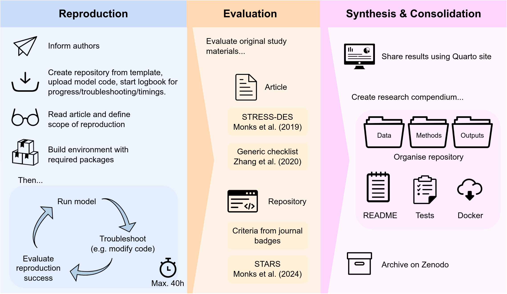

# STARS: Computational reproducibility of Wood et al. 2021 <a href="https://github.com/pythonhealthdatascience"></a>

<!-- Status badge from GitHub action checking validity of CITATION.cff -->
<!-- TODO: Add DOI badge once repository has been archived on Zenodo -->
[](https://github.com/pythonhealthdatascience/stars-reproduce-wood-2021/actions/workflows/cff_validation.yaml)

This repository forms part of work package 1 on the project STARS: Sharing Tools and Artefacts for Reproducible Simulations. It assesses the computational reproducibility of:

> Wood RM, Pratt AC, Kenward C, McWilliams CJ, Booton RD, Thomas MJ, Bourdeaux CP, Vasilakis C. **The Value of Triage during Periods of Intense COVID-19 Demand: Simulation Modeling Study**. *Medical Decision Making* 41(4):393-407 (2021). <https://doi.org/10.1177/0272989X21994035>.

## Website

⭐ **[Click here to check out the website for this repository](https://pythonhealthdatascience.github.io/stars-reproduce-wood-2021/)** ⭐

This website is created using Quarto and hosted using GitHub Pages. It shares everything from this computational reproducibility assessment.

## Protocol

The protocol for this work is summarised in the diagram below and archived on Zenodo:

> Heather, A., Monks, T., Harper, A., Mustafee, N., & Mayne, A. (2024). Protocol for assessing the computational reproducibility of discrete-event simulation models on STARS. Zenodo. <https://doi.org/10.5281/zenodo.12179846>.



## Repository overview

<!-- TODO: Update this if you amend the structure or contents of the repository -->
```bash
├── .github
│   └──  workflows
│        └──  ...
├── evaluation
│   └──  ...
├── logbook
│   └──  ...
├── original_study
│   └──  ...
├── quarto_site
│   └──  ...
├── reproduction
│   └──  ...
├── .gitignore
├── CHANGELOG.md
├── CITATION.cff
├── CONTRIBUTING.md
├── LICENSE
├── README.md
├── _quarto.yml
├── citation_apalike.apa
├── citation_bibtex.bib
├── index.qmd
└── requirements.txt
```

**Key sections:** These folders have all the content related to the original study and reproduction...

* **`original_study/`** - Original study materials (i.e. journal article, supplementary material, code and any other research artefacts).
* **`reproduction/`** - Reproduction of the simulation model. Once complete, this functions as a research compendium for the model, containing all the code, parameters, outputs and documentation.
* **`evaluation/`** - Quarto documents from the evaluation of computational reproducibility. This includes the scope, assessment of reproduction success, and comparison of the original study materials against various guidelines, and summary report.
* **`logbook/`** - Daily record of work on this repository.

**Other sections:** The remaining files and folders support creation of the Quarto site to share the reproduction, or are other files important to the repository (e.g. `README`, `LICENSE`, `.gitignore`)...

* `.github/workflows/` - GitHub actions.
* `quarto_site/` - A Quarto website is used to share information from this repository (including the original study, reproduced model, and reproducibility evaluation). This folder contains any additional files required for creation of the site that do not otherwise belong in the other folders.
* `.gitignore` - Untracked files.
* `CHANGELOG.md` - Description of changes between GitHub releases and the associated versions on Zenodo.
* `CITATION.cff` - Instructions for citing this repository, created using [CFF INIT](https://citation-file-format.github.io/).
* `CONTRIBUTING.md` - Contribution instructions for repository.
* `LICENSE` - Details of the license for this work.
* `README.md` - Description for this repository. You'll find a seperate README for the model within the `reproduction/` folder, and potentially also the `original_study/` folder if a README was created by the original study authors.
* `_quarto.yml` - Set-up instructions for the Quarto website.
* `citation_apalike.bib` - APA citation generated from CITATION.cff.
* `citation_bibtex.bib` - Bibtex citation generated from CITATION.cff.
* `index.qmd` - Home page for the Quarto website.
* `requirements.txt` - Environment for creation of Quarto site (used by `.github/workflows/quarto_publish.yaml`).

## Citation

If you wish to cite this repository, please refer to the citation file `CITATION.cff`, and the auto-generated alternatives `citation_apalike.apa` and `citation_bibtex.bib`.

## License

<!-- TODO: Add license name and link -->
This repository is licensed under the [license and link to file].

<!-- TODO: Add license name and link (e.g. "who also licensed their work under the [MIT License](link)") -->
This is aligned with the original study, who [license and link to file].

## Funding

This work is supported by the Medical Research Council [grant number MR/Z503915/1].
